.. _1.0.2/filter-it:

###########
|filter-it|
###########

.. contents:: Table of contents
   :backlinks: none

.. admonition:: Copyright

   |copy| Copyright 2012-2013 by Silicos-it, a division of Imacosi BVBA

   Filter-it is free software; you can redistribute it and/or modify
   it under the terms of the GNU Lesser General Public License as published 
   by the Free Software Foundation, either version 3 of the License, or
   (at your option) any later version.

   Filter-it is distributed in the hope that it will be useful,
   but without any warranty; without even the implied warranty of
   merchantability or fitness for a particular purpose. See the
   `GNU Lesser General Public License <http://www.gnu.org/licenses/>`_
   for more details.

   Filter-it is linked against **OpenBabel** version 2. 
   **OpenBabel** is free software; 
   you can redistribute it and/or modify it under the terms of the GNU 
   General Public License as published by the Free Software Foundation 
   version 2 of the License.

.. admonition:: Version

   Filter-it 1.0.2

.. admonition:: Feedback
   
   Join our `Google groups community 
   <http://groups.google.com/group/silicos-it-chemoinformatics>`_
   to talk about inconsistencies, errors, raise questions or to make suggestions 
   for improvement.

************
Introduction
************

|filter-it| is a program for filtering out molecules with unwanted properties. It is build on top of 
**OpenBabel** open source C++ API for rapid calculation of 
molecular properties.

The program is packaged with a number of pre-programmed molecular properties that can be used
for filtering. These properties include, amongst others:

* Physicochemical parameters, such as logP, topological polar surface area criteria, 
  number of hydrogen bond acceptors and donors, and Lipinski’s rule-of-five;
* Graph-based properties, including ring-based parameters and rotatable bond criteria;
* Selection criteria by means of smarts patterns;
* Similarity criteria;
* Three-dimensional distances between user-definable fragments.

|filter-it| is a command line-driven program that is instructed by means of command line options 
and a user-definable filter file. It is by means of this filter file that the user can 
define the actual filter criteria to be used. :ref:`Figure 1<1.0.2/filterit_figure01>` describes the 
actual data flow:

.. _1.0.2/filterit_figure01:

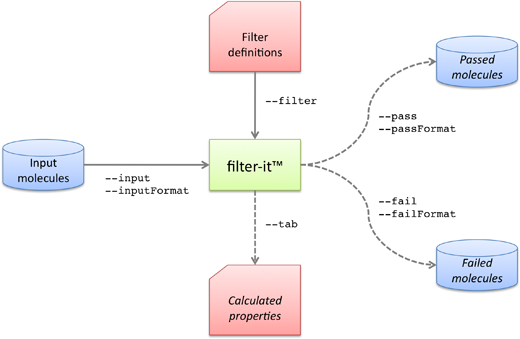

   Figure 1. The input and output flow of molecules and associated files in the program |filter-it|.
   Command line options are also indicated.

With a set of molecules as input, the program |filter-it| categorizes these input molecules into 1)
a set of molecules that fulfill all criteria as defined in the filter definition file 
(passed molecules), and 2) a set of molecules that do not fulfill at least one of the defined 
filter criteria (failed molecules).

The program |filter-it| can also be run in tabulate mode where it functions as a property calculator. 
In this mode, the requested properties of all input molecules are simply calculated and tabulated. 
No filtering is done in this mode. This option might be useful for database characterization and 
for optimization of the filter parameters.

*****
Usage
*****

.. highlight:: console

Command line interface
======================

|filter-it| is run from the command line as follows::

	> filter-it [options]

Options can be *required* or *optional*. If one or more of the *required* options is missing, the 
program stops and displays an error message:

.. literalinclude:: /_static/filter-it.txt

Some options require an argument to be followed. For these cases, the argument is linked to
the option with the ``=`` sign::

	> filter-it --input=myfile.txt

.. important::
   For options that may accept an argument, one should use the ``=`` character to link
   the option name to its argument. Leaving away this ``=`` character will lead to errors
   in the functioning of the tool.

   
The following sections describe in detail the different options.

Required command line options
=============================

:option:`--input=[file]`
	Specifies the name of the file containing the input molecules. The input file contains 
	one or more molecules specified as a set of connection tables according specific molecular 
	formats. The format of these connection tables is specified by the input filename extension
	or, with higher priority, by the optional :option:`--inputFormat` option. The allowed input 
	formats are those that are supported by **OpenBabel**. Compressed file formats are also allowed.
	The *[file]* specification is required.

:option:`--filter=[file]`
	This option specifies a the name of the filter file that describes the filter criteria to apply 
	to the input molecules. A detailed overview of the specific format of this file and a list 
	of all parameters is provided in the section on :ref:`filter parameters<1.0.2/filterit_filter_parameters>`. 
	The *[file]* specification is required.
	

.. tip::

	Use ``obabel -L formats read`` and ``obabel -L formats write`` to get a list of all read and write 
	formats recognized by **OpenBabel**.

Optional command line options
=============================

:option:`--inputFormat=[format]`
	Specifies the format of the input file. The *[format]* specification is required when using 
	this option. Allowed formats are the ones that are supported by **OpenBabel**.

:option:`--pass=[file]`
	Specifies the name of the file to which the molecules are written that have successfully 
	passed all the filter criteria. The format of the file is specified by the file extension
	or, with higher priority, by the :option:`--passFormat` option. If the file extension is 
	``.gz``, a compressed file will be written. The *[file]* specification is required when using 
	this option. In case a tabulate run mode has been requested (with the :option:`--tab` option), 
	then this argument is not required. Instead, in this situation the argument is simply 
	ignored by the program.

:option:`--passFormat=[format]`
	Specifies the format of the pass file. The *[format]* specification is required when using 
	this option. Allowed formats are the ones that are supported by **OpenBabel**.
	
:option:`--fail=[file]`
	Specifies the file to which molecules are written that fail for at least one of the filter 
	criteria. The format of the file is specified by the file extension or, with higher priority, 
	by the :option:`--failFormat` option. If the extension is ``.gz``, a compressed file will be 
	written. The *[file]* specification is required when using this option. In case a tabulate 
	run mode has been requested (with the :option:`--tab` option), then this argument is not 
	required. Instead, in this situation the argument is simply ignored by the program.
	
:option:`--failFormat=[format]`
	Specifies the format of the fail file. The *[format]* specification is required when using 
	this option. Allowed formats are the ones that are supported by **OpenBabel**.
	
:option:`--tab` or :option:`--tab=[file]`
	This flag directs the program to calculate all properties listed in the filter definition 
	file without applying any filtering step. The calculated parameters are written to *[file]*. 
	The *[file]* argument is optional; if not provided all output is written to standard output.
	In case the :option:`--tab` option has been specified, the molecules are not written to the 
	:option:`--pass` and :option:`--fail` files; instead, with the :option:`--tab` option 
	specified, these latter two options are not required and are not even processed 
	by the program. Property tables as requested with :option:`--tab` are calculated for the 
	majority of properties, with the exception of a few. The properties that cannot be generated 
	during a tabulate run are indicated further down.

:option:`--salts`
	Before any property calculation and filtering step takes place in |filter-it|, each molecule
	is cleaned by removing all small fragments that are present in the molecular connection table.
	Such small fragments are often salt fragments. Implementation-wise, salts are first removed, 
	and then the actual filtering is taking place on the remaining part of the molecular entity. 
	This prevents molecules to be filtered out due to unwanted salt fragments that should have 
	been removed in first instance. The default salt-stripping step can be suppressed by 
	specifying the :option:`--salts` option, in which case no salt stripping occurs. In this case, 
	all calculations and filtering steps are performed on the entire molecule together with all 
	salt moieties that might be present in the molecular connection table.

:option:`--rename`
	Molecular titles are sometimes absent or misleading. In such cases, it might be useful to 
	rename the title of each molecule into a number reflecting the sequence of the molecule in 
	the input file. This feature is optional and is initiated with the :option:`--rename` 
	option. If this option is not provided, renaming will not occur.

:option:`--noLog`
	When the program is run in the normal filtering mode (not in the tabulate mode), output 
	messages are written to standard output to indicate whether or not the molecule fails or 
	passes the filter criteria. For large input files, this could lead to large logging files. 
	Therefore, this command line option is provided to turn off this default behaviour.

:option:`--help` or :option:`-h`
	Displays a short help on standard error.

:option:`--version` or :option:`-v`
	Displays the program version on standard error.

Standard output and standard error: where does it all go to?
============================================================

|filter-it| is a command line-driven program that produces different kinds output that
is directed to standard output, standard error and/or specific files.

All of the following output is written to **standard error**:

* Help information generated by the :option:`-h` or :option:`--help` command line arguments;
* Program version information generated by the :option:`-v` or :option:`--version` command line arguments;
* Error messages generated by the program in the course of the filtering procedure;
* Warning messages generated by the program in the course of the filtering procedure;
* The version banner generated at the start of the filtering procedure;
* The statistics banner generated at the end of the filtering procedure.

On the contrary, all of the following is written to **standard output**:

* When the program is run in :option:`--tab` mode: all calculated properties, unless when 
  requested to write to a file (:option:`--tab=[file]`);
* When not run in :option:`--tab` mode: all 'passed' or 'failed' logging information for each 
  compound. This behaviour can be switched off with the :option:`--noLog` argument.

.. tip::

	In most Unix shells, you can capture standard error using the following command::

		> filter-it [options] 2> error.log

	You can also capture standard output using the following command::

		> filter-it [options] 1> error.log

	and the next example captures both standard output and error into the same file::

		> filter-it [options] &> error.log

.. _1.0.2/filterit_filter_parameters:

*****************
Filter parameters
*****************

The filter file (specified at the command line with :option:`--filter`) specifies the filter 
criteria for all of the calculated physical properties, and specifies also the functional group 
substructures that should be included or excluded during the filtering step. Filter criteria
are specified using rules.

Rules are specified by a keyword that is optionally followed by some limits or specifications. 
Words can be separated by white space. Blanc lines, or lines starting with ``#`` of ``//``, are 
ignored. These latter can be used as comment lines.

Rule statements may be repeated in a single filter definition file. Unless indicated 
otherwise, in that case only the first encountered rule is included for the filtering.
The eight general types of rules that may occur in a filter file are:

* include rules
* title rules
* element rules
* topological property rules
* physical property rules
* fragment rules
* sdf-data rules
* distance rules

Each of these are detailed in the following sections.

Include rules
=============

.. rubric:: INCLUDE

Include rules are specified with the ``INCLUDE`` keyword, and specify the name of a file which 
should be included starting at the position of the specific include rule. The purpose of these 
include rules is to enable nesting of different filter files into one large filter specification. 
For example, one could prepare a file in which definitions of unwanted functional groups are 
specified, and another file in which definitions on drug-like physicochemical parameters are 
specified. With the ``INCLUDE`` keyword, one can merge these two files in one large set of rules.

Include rules are specified by the ``INCLUDE`` keyword followed by the name of the file that should 
be included::

   INCLUDE /Users/hans/Filters/Druglike.sieve
   INCLUDE /Users/hans/Filters/Clean.sieve

Tilde expansion is not working; only complete filenames are allowed. For example, the following 
will generate an error message and will cause the program to halt::

   INCLUDE ~/Filters/Clean.sieve

An unlimited number of ``INCLUDE`` keywords are allowed and the keywords may be nested as well. 
If more than one ``INCLUDE`` keyword is provided, all the keywords are processed in the 
same order as that these have been defined in the corresponding filter file(s).

Title rules
===========

.. rubric:: TITLE

Title rules filter the input molecules based on their molecular titles. Molecules have at most a single 
title. In sdf-files, this molecular title is typically specified as the first line of each molecular 
entry, while in SMILES entries this title could optionally be specified following the SMILES
specification separated by whitespace::

	> cat benzene.smi
	c1ccccc1 benzene

Title rules are specified with the ``TITLE`` keyword.
Multiple title rules, each specifying different title strings, may be specified. In this case, 
each of the different title rules will be checked for a valid match against each of the input 
molecules. If a match has been found between the molecule and one of the different title rules, 
the molecule is flagged to pass for this criterion. If no match could be found between the molecule 
and all of the different title rules, the molecule is flagged to fail.

The title itself should be enclosed by double quotes to allow for titles that contain spaces::

   TITLE “Molecule title”

If quotes are to be treated as being part of the title, a backslash sign should precede the quotes::

   TITLE “Molecule title \” with backslash”

In case the tabulate mode has been selected for running |filter-it| (command line option :option:`--tab`), 
specification of the ``TITLE`` keyword without the actual title string is sufficient. When run 
in this mode, the program will extract the molecular titles and write these out to the file specified
by the :option:`--tab` option.

Element rules
=============

Element rules are used to specify restrictions on the atomic elements within 
the molecules. In the current version of |filter-it|, two specific element rules have been implemented:

* ONLY_ELEMENTS
* EXCLUDED_ELEMENTS

Element rules are specified by the appropriate keyword followed by a list of element symbols. 
The specification of the elements should be separated by white space, and can be written in 
lowercase, uppercase, or a combination of both. Quotes are not allowed::

   ONLY_ELEMENTS H C N O Br I S
   EXCLUDED_ELEMENTS C N O S

For both types of element rules, only one of each is allowed in the filter file. 
If more than one identical element rule keyword is provided, only the first keyword will be processed 
and a message will be printed to warn the user that more than one identical keyword 
has been encountered. All the information provided by the subsequent identical rules in the filter 
file is neglected, as exemplified here::

	> cat filter.txt
	ONLY_ELEMENTS C H O N
	ONLY_ELEMENTS Br Cl C
	
	> filter-it --input=BIO-20111009-PPI.smi --filter=filter.txt --fail=fail.smi --noLog
	+++++++++++++++++++++++++++++++++++++++++++++++++++++++++++++++++++++++++++
	Filter-it v1.0.0 | Feb 16 2012 11:59:36

	  -> GCC:        4.2.1 (Based on Apple Inc. build 5658) (LLVM build 2335.15.00)
	  -> Open Babel: 2.3.1

	Copyright 2012 by Silicos-it, a division of Imacosi BVBA

	Filter-it is free software: you can redistribute it and/or modify
	it under the terms of the GNU Lesser General Public License as published
	by the Free Software Foundation, either version 3 of the License, or
	(at your option) any later version.

	Filter-it is distributed in the hope that it will be useful,
	but WITHOUT ANY WARRANTY; without even the implied warranty of
	MERCHANTABILITY or FITNESS FOR A PARTICULAR PURPOSE.  See the
	GNU Lesser General Public License for more details.

	You should have received a copy of the GNU Lesser General Public License
	along with Filter-it.  If not, see http://www.gnu.org/licenses/.

	Filter-it is linked against OpenBabel version 2.
	OpenBabel is free software; you can redistribute it and/or modify
	it under the terms of the GNU General Public License as published by
	the Free Software Foundation version 2 of the License.
	+++++++++++++++++++++++++++++++++++++++++++++++++++++++++++++++++++++++++++

	## INITIATING FILTER PARAMETERS ##

	> PARSING FILTER FILE "filter.txt"
	  -> ONLY_ELEMENTS  C H O N
	  -> WARNING: line 2 of file "filter.txt": duplicate ONLY_ELEMENTS keyword encountered: skipping this one.

	COMMAND_LINE OPTIONS:

	  -> Strip salts:       yes
	  -> Rename titles:     no
	  -> Tabulate mode:     no
	  -> Logging:           no
	  -> Filter file:       filter.txt
	  -> Input file:        BIO-20111009-PPI.smi
	  -> Input file format: smiles
	  -> Fail file:         fail.smi
	  -> Fail file format:  smiles

	## STARTING CALCULATIONS ##

	CALCULATED

	Molecule counts:
	 -> Passed: 62
	 -> Failed: 13
	 -> Total:  75

	## FINISHED CALCULATIONS ##
	

In this example, the molecules are filtered on the presence of the H, C, N, O elements, 
as defined by the first ``ONLY_ELEMENTS`` rule. The rule defined by the second ``ONLY_ELEMENTS``
is neglected.

In the next example, both element rules are used in the filtering since the two specific keywords 
are different::

   ONLY_ELEMENTS H C N O Br I S
   EXCLUDED_ELEMENTS Cl

In case the tabulate mode has been selected for running |filter-it| (command line option :option:`--tab`), 
then only the specification of the keyword without the elements is sufficient. When run in this mode, 
the program writes the calculated molecular formula to standard output.

.. rubric:: ONLY_ELEMENTS

This specific element rule specifies the list of elements that are allowed in the input molecules. 
Molecules consisting of additional elements that have not been specified by this rule are flagged to 
fail. Implicit and explicit hydrogen atoms are taken into account for the filtering.

In the following example, only molecules that contain elements out of the H, C, N, O, Br, I, or S 
list are flagged for passing::

   ONLY_ELEMENTS H C N O Br I S

Molecules with for example a fluor atom would be rejected according this example.

.. rubric:: EXCLUDED_ELEMENTS

This rule specifies the elements that are not allowed in the input molecules. Molecules with
elements that are specified by this rule are flagged for failure. Implicit and explicit hydrogen 
atoms are taken into account during the filtering step.

In the following example, molecules that contain one or more halogens are rejected::

   EXCLUDED_ELEMENTS F Cl Br I

Topological property rules
==========================

Topological property rules specify limits on topology-derived properties. These rules are specified 
by the appropriate keyword followed by a minimum and a maximum numerical limit for the calculated 
property::

   KEYWORD minimum maximum

The *keyword* specifies the topological property and the *minimum* and *maximum* numerical values 
specify the limit criteria that are used for the filtering. The *minimum* and *maximum* limits 
are inclusive, meaning that all molecules with a property value larger or equal than *minimum* and 
smaller or equal than *maximum* are flagged to pass for that particular property.

In cases where a minimum or maximum limit is hard to specify, for example when one does not want to 
specify a certain limit, a wildcard (``*``) character may be substituted. In the next example, all 
molecules with a minimum of 30 non-hydrogen atoms are passed through::

   ATOMS 30 *

In the next example, all molecules with more than 20 heavy atoms are filtered out::

   ATOMS * 20

which is similar as specifying::

   ATOMS 0 20

In the current version of |filter-it|, the following topological property rules have been implemented:

* ATOMS
* CARBONS
* HETERO_ATOMS
* HETERO_CARBON_RATIO
* HALIDES
* HALIDE_FRACTION
* BONDS
* ROTATABLE_BONDS
* RIGID_BONDS
* FLEXIBILITY
* CHIRAL_CENTERS
* HBOND_ACCEPTORS
* HBOND_DONORS
* LIPINSKI_ACCEPTORS
* LIPINSKI_DONORS
* FORMAL_CHARGES
* TOTAL_FORMAL_CHARGE
* RINGS
* ATOMS_IN_SMALLEST_RING
* ATOMS_IN_LARGEST_RING
* RING_FRACTION
* AROMATIC_RINGS
* ATOMS_IN_SMALLEST_AROMATIC_RING
* ATOMS_IN_LARGEST_AROMATIC_RING
* AROMATIC_RING_FRACTION
* AROMATIC_OVER_TOTAL_RING_FRACTION
* NONAROMATIC_RINGS
* ATOMS_IN_SMALLEST_NONAROMATIC_RING
* ATOMS_IN_LARGEST_NONAROMATIC_RING
* NONAROMATIC_RING_FRACTION
* RINGSYSTEMS
* ATOMS_IN_SMALLEST_RINGSYSTEM
* ATOMS_IN_LARGEST_RINGSYSTEM
* RINGSYSTEM_FRACTION
* RINGS_IN_SMALLEST_RINGSYSTEM
* RINGS_IN_LARGEST_RINGSYSTEM
* SIDECHAINS
* ATOMS_IN_SMALLEST_SIDECHAIN
* ATOMS_IN_LARGEST_SIDECHAIN
* SIDECHAIN_FRACTION
* CORES
* ATOMS_IN_CORE
* CORE_FRACTION
* BRIDGES
* ATOMS_IN_SMALLEST_BRIDGE
* ATOMS_IN_LARGEST_BRIDGE
* BRIDGE_FRACTION

For each of these topological property rules, only one of each is allowed in the filter file. 
If more than one identical rule keyword are provided, only the keyword first encountered will be processed 
correctly and a message will be printed to warn the user that more than one identical keyword has been 
found. All the information provided by the subsequent identical rules in the filter file is neglected.

When the program is run in tabulate mode (with the :option:`--tab` command line option), then the *minimum* 
and *maximum* limits are not required and do not have to be specified (although they are allowed
in the filter file).

In the following sections, all topological property rules are detailed.

Atom-based rules
----------------

.. rubric:: ATOMS

Specifies the number of non-hydrogen atoms (the so-called heavy atoms) as filter criterion. In the 
following example, all molecules with ≥10 and ≤20 heavy atoms will pass for this criterion, while 
all other molecules are rejected::

   ATOMS 10 20

.. rubric:: CARBONS

Specifies the number of carbon atoms as filter criterion. In the following example, only molecules 
with ≥10 and ≤20 carbon atoms will pass for this criterion, while all other molecules are rejected::

   CARBONS 10 20

.. rubric:: HETERO_ATOMS

Specifies the number of heteroatoms as filter criterion. Heteroatoms are defined as the atoms 
that are not hydrogen or carbon. In the following example, all molecules with ≥10 and ≤20 heteroatoms 
will pass, while all other molecules are rejected::

   HETERO_ATOMS 10 20

.. rubric:: HETERO_CARBON_RATIO

Specifies the ratio of the number of heteroatoms over the number of carbon atoms. Heteroatoms 
are defined as all atoms that are not hydrogen or carbon. For example, the ``HETERO_CARBON_RATIO`` for 
chloroform (CHCl\ :sub:`3`\ ) is 3 / 1 = 3. If there are no carbon atoms, then a value of zero is 
returned and the molecule is marked to fail for this criterion, regardless of the limit criteria. 
In the following example, all molecules with a hetero-over-carbon ratio of ≥0.5 and ≤1.5 will pass, 
while all other molecules will fail::

   HETERO_CARBON_RATIO 0.5 1.5

.. rubric:: HALIDES

Specifies the number of halide elements as filter criterion. A halide is defined as a F, Cl, Br, or 
I element. In the following example, all molecules with more than three halides are flagged to fail::

   HALIDES 0 3

.. rubric:: HALIDE_FRACTION

Specifies the ratio of the halide weight over the total molecular weight as filter criterion. A halide 
is defined as a F, Cl, Br, or I atom. Implicit hydrogen atoms are taken into account for the calculation 
of the total molecular weight. If the total molecular weight is zero, then a value of zero is returned 
and the molecule is flagged to fail for this criterion, regardless of the limit criteria. In the 
following example, all molecules with a halide-over-total weight ratio between 0.5 and 0.9 
are flagged to pass this criterion::

   HALIDE_FRACTION 0.5 0.9

.. rubric:: HBOND_ACCEPTORS

Specifies the number of hydrogen bond acceptors as filter criterion. A hydrogen bond acceptor is 
defined as an atom with one of the following properties:

* an aromatic nitrogen with no hydrogen atoms connected, no amide nitrogen, and not carrying a 
  positive charge; or
* an aliphatic nitrogen with no hydrogen atoms connected and not carrying a positive charge; or
* any oxygen atom that is not carrying a positive charge; or
* a thionyl (=S) sulfur atom;

but excluding:

* amide nitrogen atoms.

In the following example, all molecules with less than 11 hydrogen bond acceptors are allowed, 
while all other molecules are rejected::

   HBOND_ACCEPTORS 0 10

.. rubric:: HBOND_DONORS

Specifies the number of hydrogen bond donors as filter criterion. A hydrogen bond donor is defined 
as an hydrogen atom with one of the following properties:

* each hydrogen bonded to a nitrogen; or
* each hydrogen bonded to an oxygen; or
* each hydrogen bonded to a sulfur.

According these definitions, a nitrogen with one connected hydrogen is counted as one hydrogen bond donor, 
while a nitrogen with two hydrogen atoms connected is counted as two hydrogen bond donors. In the 
following example, all molecules with less than six hydrogen bond donors are flagged to pass this 
criterion, while all other molecules are flagged to fail::

   HBOND_DONORS 0 5

.. rubric:: LIPINSKI_ACCEPTORS

Specifies the number of Lipinski’s hydrogen bond acceptors as filter criterion [#lipinski]_. 
A Lipinski hydrogen bond acceptor is defined as any nitrogen or oxygen atom regardless of the number 
of connected hydrogen atoms. In the following example, all molecules with less than 11 Lipinski 
hydrogen bond acceptors are accepted, while all other molecules are rejected::

   LIPINSKI_ACCEPTORS 0 10

.. rubric:: LIPINSKI_DONORS

Specifies the number of Lipinski’s hydrogen bond donors as filter criterion [#lipinski]_. 
A Lipinski hydrogen bond donor is defined as an hydrogen atom with one of the following properties:

* each hydrogen connected to a nitrogen; or
* each hydrogen connected to an oxygen.

According these definitions, a nitrogen with one connected hydrogen is counted as one hydrogen bond donor, 
while a nitrogen with two hydrogen atoms connected is counted as two hydrogen bond donors. In the following 
example, all molecules with less than six Lipinski hydrogen bond donors are accepted, while all other 
molecules are rejected::

   LIPINSKI_DONORS 0 5

.. rubric:: FORMAL_CHARGES

This keyword specifies the total number of atoms bearing a formal charge as filter criterion. 
Correct assignment of formal charges is the responsibility of the user as |filter-it| is not modifying 
the input molecules. In the following example, only molecules with all neutral atoms neutral are 
passed successfully::

   FORMAL_CHARGES 0 0

.. rubric:: TOTAL_FORMAL_CHARGE

This keyword specifies the total molecular formal charge as filter criterion. Correct assignment 
of formal charges is the responsibility of the user as |filter-it| is not modifying the input molecules.
In the following example, only molecules with a neutral formal charge are passed successfully::

   TOTAL_FORMAL_CHARGE 0 0

Bond-based rules
----------------

.. rubric:: BONDS

Specifies the number of bonds between non-hydrogen atoms (the so-called heavy atoms) as filter 
criterion. In the following example, all molecules with ≥10 and ≤20 bonds are accepted, while 
all other molecules are rejected::

   BONDS 10 20

.. rubric:: ROTATABLE_BONDS

Specifies the number of rotatable bonds as filter criterion. A rotatable bond is defined as follows:

* bond is not double; and
* bond is not triple; and
* bond is not a primary amide (O=C-NH\ :sub:`2`\ ); and
* bond is not a secondary amide (or O=C-NH\ :sub:`1`\ -).

and excluding:

* bonds in ring; and
* end-standing bonds; and
* bonds to hydrogen atoms.

In the following example, molecules with more than 10 rotatable bonds would be excluded::

   ROTATABLE_BONDS 0 10

.. rubric:: RIGID_BONDS

Specifies the number of rigid bonds as filter criterion. A rigid bond is defined as follows:

* bond is double; or
* bond is triple; or
* bond is a secondary amide (O=C-NH\ :sub:`1`\ -);

but excluding:

* end-standing bonds; and
* bonds to hydrogen atoms; and
* bonds in ring.

In the following example, molecules with more than 10 rigid bonds would be excluded by this filter 
criterion::

   RIGID_BONDS 0 10

.. rubric:: FLEXIBILITY

Flexibility is defined as the ratio of the number of rotatable bonds (as defined by the 
``ROTATABLE_BONDS`` property) over the total number of bonds (as defined by the sum of the 
``ROTATABLE_BONDS`` and ``RIGID_BONDS`` properties). The flexibility is always between 0 and 1, 
with 0 the extreme case when the molecule contains no rotatable bonds, and 1 being the theoretical 
case when all bonds are rotatable. When the molecule contains no bonds, a value of zero 
is returned and the molecule is filtered according the specified criteria. When the molecule contains 
no non-hydrogen atoms, a value of zero is returned and the molecule is flagged to fail for 
this criterion. In the following example, molecules with a flexibility between 0.3 and 0.5 are 
passed along::

   FLEXIBILITY 0.3 0.5

Chirality-based rules
---------------------

.. rubric:: CHIRAL_CENTERS

Specifies the number of chiral centers as filter criterion. In the following example, all molecules 
with less than three chiral centers are flagged for acceptance, while all other molecules are rejected::

   CHIRAL_CENTERS 0 2

Ring-based rules
----------------

:ref:`Figure 2 <1.0.2/filterit_figure02>` illustrates the concept of rings and ringsystems. Rings are 
detected by a smallest-subset-of-smallest-rings (SSSR) algorithm, as implemented by **OpenBabel** 
and based on the **Blue Obelisk** `findSmallestSetOfSmallestRings 
<http://qsar.sourceforge.net/dicts/blue-obelisk/index.xhtml#findSmallestSetOfSmallestRings>`_ 
algorithm. 

.. _1.0.2/filterit_figure02:

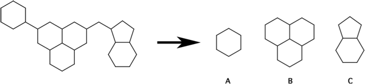

   Figure 2. The concept of rings and ringsystems illustrated by example. In this example, the 
   molecule consists of three ringsystems (A-C) and six rings. The number of atoms in each of 
   these three ringsystems varies between 6 (ringsystem A) and 13 (ringsystem B), while the 
   number of atoms in the rings varies between five and six.
 
.. rubric:: RINGS

Specifies the total number of rings as filter criterion. If the input molecule has no rings 
then a value of zero is returned and the specified *minimum* and *maximum* criteria determine 
whether the molecule will be passed or not. In the following example, molecules with five to six 
rings would be passed::

  RINGS 5 6
 
.. rubric:: ATOMS_IN_SMALLEST_RING

Specifies a limit on the number of atoms in the smallest ring. With reference to the example in 
:ref:`Figure 2<1.0.2/filterit_figure02>`, the smallest ring is the five-membered ring in ringsystem ‘C’,
containing five atoms. When the molecule has no rings, a value of zero is returned and the molecule
is flagged to pass for thsi criterion. In the following example, only molecules with no rings, 
or with the smallest ring consisting of 5 to 6 atoms, are passed succesfully::

   ATOMS_IN_SMALLEST_RING 5 6

.. rubric:: ATOMS_IN_LARGEST_RING

Specifies a limit on the number of atoms in the largest ring. With reference to the example in 
:ref:`Figure 2<1.0.2/filterit_figure02>`, the largest ring is the six-membered ring in ringsystems ‘A’, 
‘B’ or ‘C’, each containing 6 atoms. When the molecule has no rings, filtering is not performed 
(the molecule is flagged as 'passed') and a value of zero is returned. In the following example, 
only molecules with no rings, or with the largest ring consisting of 5 to 6 atoms, are flagged 
to pass this criterion::

   ATOMS_IN_LARGEST_RING 5 6

.. rubric:: RING_FRACTION

The ring fraction is calculated as the number of ring atoms divided by the total number of atoms. 
The outcome is always a number between 0 and 1, both numbers inclusive. Hydrogen atoms are not taken 
into account for the calculation. If the input molecule has no rings then a value of zero is returned 
and the specified *minimum* and *maximum* parameters will determine whether the molecule should pass
or not. When the molecule contains no non-hydrogen atoms, a value of zero is returned and the molecule is 
marked to fail for this criterion. In the following example, molecules with no rings, or with a maximum 
of 30% of all non-hydrogen atoms being part of rings, are passed through::

   RING_FRACTION 0 0.3

.. rubric:: AROMATIC_RINGS

Specifies the total number of aromatic rings as filter criterion. If the input molecule has no rings 
then a value of zero is returned and the specified *minimum* and *maximum* parameters determine whether 
the molecule will be passed or not. In the following example, molecules with one to two aromatic rings 
would be passed::

   AROMATIC_RINGS 1 2

.. rubric:: ATOMS_IN_SMALLEST_AROMATIC_RING

Specifies a limit on the number of atoms in the smallest aromatic ring. When the molecule has no rings, 
a value of zero is returned and the molecule is flagged to pass for this criterion. In the following 
example, only molecules with no rings, or with the smallest aromatic ring consisting of 5 to 6 atoms, 
are passed::

   ATOMS_IN_SMALLEST_AROMATIC_RING 5 6

.. rubric:: ATOMS_IN_LARGEST_AROMATIC_RING

Specifies a limit on the number of atoms in the largest aromatic ring. When the molecule has no rings, 
a value of zero is returned and the molecule passes this criterion. In the following example, only 
molecules with no rings, or with the largest aromatic ring consisting of 5 to 6 atoms, are 
passed::

   ATOMS_IN_LARGEST_AROMATIC_RING 5 6

.. rubric:: AROMATIC_RING_FRACTION

The aromatic ring fraction is calculated as the number of aromatic ring atoms divided by the total 
number of atoms. The outcome is always a number between 0 and 1, both limits inclusive. Hydrogen 
atoms are not taken into account for the calculation. If the input molecule has no rings then a value 
of zero is returned and the specified *minimum* and *maximum* parameters determine whether the molecule 
will pass. When the molecule contains no non-hydrogen atoms, a value of zero is returned and the 
molecule is marked to fail for this criterion. In the following example, molecules with no rings, or 
with a maximum of 30% of all non-hydrogen atoms being part of aromatic rings, are passed through::

   AROMATIC_RING_FRACTION 0 0.3

.. rubric:: AROMATIC_OVER_TOTAL_RING_FRACTION

The ``AROMATIC_OVER_TOTAL_RING_FRACTION`` is calculated as the number of aromatic ring atoms 
divided by the total number of rings. The outcome is always a number between 0 and 1, both numbers inclusive. 
If the input molecule has no aromatic rings then a value of zero is returned and the specified *minimum* 
and *maximum* parameters determine whether the molecule will be passed or not. When the molecule contains no 
non-hydrogen atoms or contains no rings, a value of zero is returned and the molecule is marked to fail 
for this criterion. In the following example, molecules with no aromatic rings, or with a maximum of 
30% of all rings being aromatic, are passed::

   AROMATIC_OVER_TOTAL_RING_FRACTION 0 0.3

.. rubric:: NONAROMATIC_RINGS

Specifies the total number of non-aromatic rings as filter criterion. If the input molecule has no rings 
then a value of zero is returned and the specified *minimum* and *maximum* parameters determine whether 
the molecule will be passed or not. In the following example, molecules with one to two non-aromatic rings 
would be passed::

   NONAROMATIC_RINGS 1 2

.. rubric:: ATOMS_IN_SMALLEST_NONAROMATIC_RING

Specifies a limit on the number of atoms in the smallest non-aromatic ring. When the molecule has no rings, 
a value of zero is returned and the molecule is passed for this criterion. In the following example, 
only molecules with no rings, or with the smallest non-aromatic ring consisting of 5 to 6 atoms, are 
passed::

   ATOMS_IN_SMALLEST_NONAROMATIC_RING 5 6

.. rubric:: ATOMS_IN_LARGEST_NONAROMATIC_RING

Specifies a limit on the number of atoms in the largest non-aromatic ring. When the molecule has no rings, 
filtering is not performed and a value of zero is returned. In the following example, only molecules with 
no rings, or with the largest non-aromatic ring consisting of 5 to 6 atoms, are passed::

   ATOMS_IN_LARGEST_NONAROMATIC_RING 5 6

.. rubric:: NONAROMATIC_RING_FRACTION

The non-aromatic ring fraction is calculated as the number of non-aromatic ring atoms divided by the 
total number of atoms. The outcome is always a number between 0 and 1, both numbers inclusive. 
Hydrogen atoms are not taken into account for the calculation. If the input molecule has no rings 
then a value of zero is returned and the specified *minimum* and *maximum* parameters determine whether 
the molecule will pass. When the molecule contains no non-hydrogen atoms, a value of zero 
is returned and the molecule is marked to fail for this criterion. In the following example, molecules 
with no rings, or with a maximum of 30% of all non-hydrogen atoms being part of non-aromatic rings, are 
passed through::

   NONAROMATIC_RING_FRACTION 0 0.3

.. rubric:: NONAROMATIC_OVER_TOTAL_RING_FRACTION

The ``NONAROMATIC_OVER_TOTAL_RING_FRACTION`` is calculated as the number of non-aromatic ring atoms 
divided by the total number of rings. The outcome is always a number between 0 and 1, both numbers 
inclusive. If the input molecule has no non-aromatic rings then a value of zero is returned and 
the specified *minimum* and *maximum* parameters determine whether the molecule will pass.
When the molecule contains no non-hydrogen atoms or contains no rings, a value of zero is returned 
and the molecule is marked to fail for this criterion. In the following example, molecules with no 
rings, or with a maximum of 30% of all rings being non-aromatic, are passed through::

   NONAROMATIC_OVER_TOTAL_RING_FRACTION 0 0.3

.. rubric:: RINGSYSTEMS

Specifies a limit on the number of ringsystems in a molecule. The entire ringsystem of a molecule is 
defined as the entire set of rings that remain after deleting all the atoms and bonds that do not 
belong to at least one ring. In the following example, only molecules with four ringsystems will be 
flagged to pass::

   RINGSYSTEMS 4 4

If the input molecule has no rings then a value of zero is returned and filtered according the 
specified *minimum* and *maximum* parameters.

.. rubric:: ATOMS_IN_SMALLEST_RINGSYSTEM

Specifies a limit on the number of atoms in the smallest ringsystem. The quantification of 
‘smallest ringsystem’ is based on the number of atoms in the ringsystem. With reference to the 
example in :ref:`Figure 2<1.0.2/filterit_figure02>`, the smallest ringsystem is ringsystem ‘A’, which 
contains 6 atoms. When the molecule has no rings, a value of zero is returned and the molecule
is passing for this criterion. In the following example, only molecules with no rings, or with 
the smallest ring consisting of 5 to 6 atoms, are passed::

   ATOMS_IN_SMALLEST_RINGSYSTEM 5 6

.. rubric:: ATOMS_IN_LARGEST_RINGSYSTEM

Specifies a limit on the number of atoms in the largest ringsystem. The quantification 
of ‘largest ringsystem’ is based on the number of atoms in the ringsystem. With reference to the 
example in Figure 2, the largest ringsystem is ‘B’, containing 13 atoms. When the molecule has no 
rings, a value of zero is returned and is flagged to pass. In the following example, 
only molecules with no rings, or with a largest ringsystem consisting of up to 7 atoms, are passed::

   ATOMS_IN_LARGEST_RINGSYSTEM * 7

.. rubric:: RINGSYSTEM_FRACTION

The ringsystem fraction is calculated as the number of ringsystem atoms divided by the total number of atoms. 
The outcome is always a number between 0 and 1, both numbers inclusive. Hydrogen atoms are not taken into 
account for the calculation. This filter produces exactly the same result as the ``RING_FRACTION`` filter. 
If the input molecule has no rings then a value of zero is returned and the specified *minimum* and *maximum* 
parameters determine whether the molecule will be passed or not. When the molecule contains no non-hydrogen 
atoms, a value of zero is returned and the molecule is marked to fail for this criterion. In the following 
example, molecules with no rings, or with a maximum of 30% of all non-hydrogen atoms being part of a 
ringsystem, are passed through::

   RINGSYSTEM_FRACTION 0 0.3

.. rubric:: RINGS_IN_SMALLEST_RINGSYSTEM

Specifies a limit on the number of rings in the smallest ringsystem. The quantification of 
‘smallest ringsystem’ is based on the number of rings in the ringsystem. This is different to the 
``ATOMS_IN_SMALLEST_RINGSYSTEM`` filter, in whcih the number of atoms is used as quantification. 
With reference to the example in :ref:`Figure 2<1.0.2/filterit_figure02>`, the smallest ringsystem is 
ringsystem ‘A’, containing a single ring. When the molecule has no rings, a value of zero is returned
and the molecule is flagged to pass for this criterion. In the following example, only molecules 
with no rings, or with the smallest ringsystem consisting of one ring, would be passed::

   RINGS_IN_SMALLEST_RINGSYSTEM 1 1

.. rubric:: RINGS_IN_LARGEST_RINGSYSTEM

Specifies a limit on the number of rings in the largest ringsystem. The quantification of 
‘largest ringsystem’ is based on the number of rings in the ringsystem. This is different to the 
``ATOMS_IN_LARGEST_RINGSYSTEM`` filter, where the number of atoms is used as quantification. 
With reference to the example in :ref:`Figure 2<1.0.2/filterit_figure02>`, the largest ringsystem is 
ringsystem ‘C’, which contains three rings. When the molecule has no rings, 
a value of zero is returned and the molecule is flagged to pass for this criterion. In the 
following example, only molecules with no rings, or with the largest ringsystem consisting of 
one ring, would be passed::

   RINGS_IN_LARGEST_RINGSYSTEM 1 1

Molecular skeleton-based rules
------------------------------

.. _1.0.2/filterit_figure03:

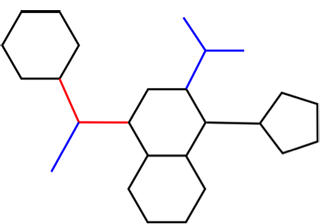

   Figure 3 The concept of ‘sidechains’, ‘bridges’, and ‘cores’ illustrated on a virtual molecule.
   In this example, the molecule contains two ‘sidechains’ (colored in blue), one ‘bridge’ 
   (shown in red). Finally, the ‘core’ of the molecule is composed of the black lines (the 
   ringsystems) in combination with the ‘bridges’ (red lines).

.. rubric:: SIDECHAINS

Specifies the total number of sidechains as filter criterion. Sidechains are calculated in an 
iterative fashion by virtually removing all atoms having a connectivity of one, until no more such 
atoms remain. The set of all removed atoms compose the sidechain atoms. Hydrogen atoms are not 
taken into account for the calculation. :ref:`Figure 3<1.0.2/filterit_figure03>` above illustrates 
the concept of sidechains on an example molecule. The molecule shown in :ref:`Figure 
3<1.0.2/filterit_figure03>` contains two sidechains. Hydrogen atoms are excluded. If the input 
molecule has no rings then a value of zero is returned and the specified *minimum* and *maximum* 
parameters determine whether the molecule will be passed or not. In the following example, 
only molecules with five sidechains would be passed::

   SIDECHAINS 5 5

.. rubric:: ATOMS_IN_SMALLEST_SIDECHAIN

Specifies a limit on the number of atoms in the smallest sidechain of the molecule. In the 
example above in :ref:`Figure 3 <1.0.2/filterit_figure03>`, the smallest sidechain contains one atom. 
Hydrogen atoms are excluded from the calculation. When the molecule has no rings, filtering 
is not performed and a value of zero is returned. In the following example, only molecules 
with either no sidechains, or molecules where the smallest sidechain may consist between one 
and three atoms, would be passed::

   ATOMS_IN_SMALLEST_SIDECHAIN 1 3

.. rubric:: ATOMS_IN_LARGEST_SIDECHAIN

Specifies a limit on the number of atoms in the largest sidechain of the molecule. Hydrogen 
atoms are excluded from the calculation. This criterion returns zero if the molecule contains 
no sidechains, and in this case the filtering is not applied. In the example above in :ref:`Figure 
3 <1.0.2/filterit_figure03>`, the largest sidechain contains three atoms. In case the molecule has no 
rings, filtering is not performed and a value of zero is returned. In the following example, 
only molecules with either no sidechains, or molecules where the largest sidechain may consist 
between one and three atoms, would be passed::

   ATOMS_IN_LARGEST_SIDECHAIN 1 3

.. rubric:: SIDECHAIN_FRACTION

Specifies the fraction of sidechain atoms over the total atom count as filter criterion. 
Hydrogen atoms are excluded from the calculation. If the input molecule has no rings then a 
value of zero is returned and the specified *minimum* and *maximum* parameters determine whether 
the molecule will be passed or not. When the molecule contains no non-hydrogen atoms, a value 
of zero is returned and the molecule is marked to fail for this criterion. In the following 
example, molecules of which at least half of its atoms are sidechain atoms are passed through::

   SIDECHAIN_FRACTION 0.5 *

.. rubric:: CORES

Specifies the total number of core fragments as filter criterion. Cores are the remaining 
atoms when all sidechains have been removed (see :ref:`Figure 3<1.0.2/filterit_figure03>`). According 
the definition of a core, molecules can contain either a single core or no core at all. If the 
input molecule has no rings then a value of zero is returned and the specified filter criteria
determine whether the molecule will be passed or not. In the following 
example, only molecules having a single core would be passed::

   CORES 1 1

.. rubric:: ATOMS_IN_CORE

Specifies a limit on the number of atoms in the core of the molecule. Hydrogen atoms are 
excluded from the calculation. When the molecule does not contain a core, then a value of 
zero is returned and filtering is not performed. In the following example, only molecules 
with either no core, or molecules with a core consisting of exactly 22 atoms would be passed::

   ATOMS_IN_CORE 22 22

.. rubric:: CORE_FRACTION

Specifies the fraction of core atoms over the total atom count as filter criterion. Hydrogen 
atoms are excluded from the calculation. This criterion returns zero if the molecule contains 
no cores, and the filtering is applied according the limits specified as criteria. When the 
molecule contains no non-hydrogen atoms, a value of zero is returned and the molecule is 
marked to fail for this criterion. In the following example, molecules of which at least 
half of its atoms are core atoms are passed through::

   CORE_FRACTION 0.5 *

.. rubric:: BRIDGES

Specifies the total number of bridge fragments as filter criterion. Hydrogen atoms are excluded from
the calculations. Bridges are calculated as the remaining atoms when all sidechains and ring systems 
have been removed (:ref:`Figure 3<1.0.2/filterit_figure03>`). If the input molecule has no rings then a 
value of zero is returned and the specified filter criteria determine whether the molecule will be 
passed or not. In the following example, only molecules having two or three bridges would be passed::

   BRIDGES 2 3

.. rubric:: ATOMS_IN_SMALLEST_BRIDGE

Specifies a limit on the number of atoms in the smallest bridge of the molecule. Hydrogen atoms 
are not counted. When the molecule does not contain a bridge a value of zero is returned and 
filtering is not performed. In the following example, only molecules with either no bridge, 
or molecules in which the smallest bridge contains between one and three atoms would be passed::

   ATOMS_IN_SMALLEST_BRIDGE 1 3

.. rubric:: ATOMS_IN_LARGEST_BRIDGE

Specifies a limit on the number of atoms in the largest bridge of the molecule. Hydrogen atoms 
are not counted. When the molecule does not contain a bridge a value of zero is returned and 
filtering is not performed. In the following example, only molecules with either no bridge, or 
molecules in which the largest bridge contains between one and three atoms would be passed::

   ATOMS_IN_LARGEST_BRIDGE 1 3

.. rubric:: BRIDGE_FRACTION

Specifies the fraction of bridge atoms over the total atom count as filter criterion. Hydrogen 
atoms are excluded from the calculation. A value of zero is returned when the molecule contains 
no bridges, and the filtering is applied according the limits specified as parameters. When the 
molecule contains no non-hydrogen atoms, a value of zero is returned and the molecule will be 
marked to fail for this criterion. In the following example, molecules of which at least half 
of its atoms are bridge atoms are passed through::

   BRIDGE_FRACTION 0.5 *

Physical property rules
=======================

Physical property rules specify limits on a number of physical properties. Physical property 
rules are specified in a manner identical to the topological property rules, i.e. using the 
appropriate *keyword* followed by a *minimum* and a *maximum* limit for the particular property::

   KEYWORD minimum maximum

In the current version of |filter-it|, the following physical property rules have been implemented:

* MOLWT
* LOGP
* LOGS
* TPSA
* ANDREWS_ENERGY
* LIGAND_EFFICIENCY

For each of these physical property rules, only one of each is allowed in the filter file. 
If more than one identical rule keyword is provided, only the first encountered keyword will be 
processed correctly and a message will be printed to warn the user that more than one identical 
keyword has been encountered. All the information provided by the subsequent identical rules in the 
filter file is neglected.

When the program is run in tabulate mode (with the :option:`--tab` command line option), the *minimum* 
and *maximum* limits are not required.

The following sections detail each of the physical property rules.

.. rubric:: MOLWT

Specifies the molecular weight as filter criterion. In the following example, all molecules with 
a molecular weight ≥300 and ≤500 Dalton are accepted, while all other molecules are rejected::

   MOLWT 300 500

.. rubric:: LOGP

Specifies a limit on the calculated logP, which is the negative logarithm of the octanol/water 
distribution of the compound. Compounds with a preference for fatty environments will have a 
large logP, while the logP of more polar compounds will be lower or negative. The algorithm 
for calculating the logP is based on **Silicos-it**’s implementation as described in detail 
:ref:`below<1.0.2/logp>`. In the following example, only molecules with a calculated logP ≤5 are 
passed through::

   LOGP * 5

.. rubric:: LOGS

Specifies a limit on the calculated logS, which is the negative logarithm of the water solubility 
of the compound. Soluble compounds will have a large logS, while rather insoluble compounds will 
have a small or negative logS. The algorithm for calculating the logP is based on a proprietary 
implementation of **Silicos-it** and is explained in detail :ref:`below<1.0.2/logs>`. In the following 
example, only molecules with a calculated logS ≤-5 are passed through::

   LOGS * -5

.. rubric:: TPSA

Specifies a limit on the topological polar surface area. The algorithm for calculating the 
topological polar surface area is based on the Ertl implementation [#ertl]_, and is expressed in 
squared Å. In the following example, only molecules with a calculated topological polar 
surface area ≤150 Å are passed through::

   TPSA 0 150

.. rubric:: ANDREWS_ENERGY

This parameter specifies limits on the predicted molecular binding energy calculated according 
a modified version of the method of Andrews and coworkers [#andrews]_. When using this filter 
parameter, it is important that the correct ionization state of the molecules is used. As 
the Andrews’ energy depends heavily on the correct protonation state of primary 
amines, carboxylic acids and phosphate groups, care should be taken that these moieties are 
input in their correct ionization form. As |filter-it| does not take care of that, it becomes the 
user's responsability. In the following example, only molecules with an Andrews’ energy between 10 and 
15 kcal/mol are passed through::

   ANDREWS_ENERGY 10 15

.. rubric:: LIGAND_EFFICIENCY

The ligand efficiency of a molecule is normally defined as being the total binding energy 
(expressed in kcal/mol units) for a given protein target divided by the number of non-hydrogen 
atom of the ligand. The ligand efficiency provided in this context is the maximal value that 
might be expected for a given compound in case of optimal interaction with the protein. For 
implementation details, see :ref:`below<1.0.2/le>`. In the following example, only molecules with a 
predicted ligand efficiency higher than 0.37 (the mean of the training set) are passed 
through::

   LIGAND_EFFICIENCY 0.37 *

ADMET rules
===========

ADMET property rules specify limits on a number of *in silico* ADME/tox properties. ADMET 
property rules are specified in a manner identical to the topological property rules, 
*i.e.* using the appropriate *keyword* followed by a *minimum* and a *maximum* limit for the 
particular property::

   KEYWORD minimum maximum

In the current version of |filter-it|, the following ADME/tox-related property rules have 
been implemented:

* ADMET_SCORE
* LIPINSKI_VIOLATIONS
* ABSORPTION

For each of these three property rules, only one of each is allowed in the filter file. 
If more than one identical keyword is provided, only the first keyword will be 
processed correctly and a message will be printed to warn the user that more than one 
identical keyword has been encountered. All the information provided by the subsequent 
identical rules in the filter file is neglected. When the program is run in tabulate 
mode (with the :option:`--tab` command line option), the *minimum* and *maximum* limits 
are not required.

In the following sections, each of the specific ADME/tox property rules have been detailed.

.. rubric:: ADMET_SCORE

Specifies the ADMET score as filter criterion. The ADMET score has been orginally described 
by Gleeson and coworkers [#gleeson]_ and is calculated according the following equation:

.. raw:: html

   $$ \text{ADMET_SCORE} = \frac{\vert 2.5 - logp \vert}{2.0} + \frac{\vert 330 - mw \vert}{120} $$

with *mw* being the molecular weight of the molecule (calculated with the ``MOLWT`` paramete)
and *logp* the calculated logP (calculated with the ``LOGP`` parameter). If the molecular 
weight is less than 330 da, a value of zero is used as molecular mass. 

In the following example, all molecules with a maximum ``ADMET_SCORE`` of 1 
are accepted, while all other molecules are rejected::

   ADMET_SCORE * 1

.. rubric:: LIPINSKI_VIOLATIONS

This parameter specifies a limit on the number of violations against Lipinski’s rule-of-five
[#lipinski]_. This rule-of-five is defined as:

* Number of Lipinski’s hydrogen bond acceptors should be ≤10 
  (calculated with the ``LIPINSKI_ACCEPTORS`` keyword);
* Number of Lipinski’s hydrogen bond donors should be ≤5 
  (calculated with the ``LIPINSKI_DONORS`` keyword);
* Calculated logP should be ≤5 (calculated with the ``LOGP`` keyword);
* Molecular weight should be ≤500 (calculated with the ``MOLWT`` keyword).

In the following example, only molecules with at most one violation against Lipinski’s 
rule-of-five are passed through::

   LIPINSKI_VIOLATIONS 0 1

.. rubric:: ABSORPTION

This parameter specifies a limit on the predicted passive intestinal absorption (PAI) of drugs. 
The PAI is calculated according a paper of Egan and coworkers [#egan]_, and is based on a 
multivariate analysis of the molecular topological polar surface area and the calculated logP. 
The calculated absorption property returns only two possible values:

* ``1`` (‘true’) if the predicted PAI for the compound is higher than 90%. In the original 
  publication [#egan]_, these compounds are labeled as ‘WAbs’ 
  (‘well-absorbed’);
* ``0`` (‘false’) if the predicted PAI for the compound is lower than 30%. This corresponds
  to the ‘PAbs’ (‘poorly-absorbed’) compounds in the original publication [#egan]_.

In the following example, only molecules that are predicted to be well-absorbed will be 
passed through::

   ABSORPTION 1 1

To retrieve only compounds that are not passively absorbed, the following statement may be 
used::

   ABSORPTION * 0

which is similar to::
   
   ABSORPTION 0 0

Fragment and similarity filters
===============================

Fragment rules are specifications to define limits on the presence of user-definable 
molecular substructures within the input molecules. These substructures are defined by 
means of a SMARTS pattern, and the user can put limits on the number of occurrences for 
these particular fragments in each molecule. When counting the number of 
occurrences of a particular substructure in a target molecule, only unique matches are 
taken into account. A unique match is defined as one that does not cover the identical atoms 
that a previous match has covered. For instance, searching for the ``c1ccccc1`` pattern in 
phenol will only yield one unique match.

In addition to specifying limits on the number of substructures present in the input file 
molecules, the user can also define similarity rules to specify criteria on the required 
minimum or maximum Tanimoto similarity to a reference fragment or reference molecule.

If a match has been found between the molecule and a fragment or if the similarity to a 
reference molecule is between the limits set by the similarity rule, the 
molecule is passed for this criterion. If a match cannot be found between the molecule and 
the fragment or if the similarity criteria are not satisfied, the molecule is flagged to fail 
for this rule. Multiple fragment rules, each specifying different fragment or similarity 
cutoffs, may be specified. In this case, each of the different rules will be checked for a 
valid match against each of the input molecules. A molecule is only passed successfully 
when it succeeds for all of the specified rules. This is different to the implementation 
of the ``TITLE`` keyword where multiple keywords may be provided, but where a molecule is 
passed successfully when matching at least one of the title keywords.

In the current version of |filter-it|, the following fragment and similarity rules have been 
implemented:

* FRAGMENT
* SIMILARITY
* SIMILARITY_STACK

In the following sections, these fragment property rules are described in more detail.

.. _1.0.2/filterit_fragment:

.. rubric:: FRAGMENT

The general syntax of fragment rule is::

   FRAGMENT name smarts minimum maximum

``FRAGMENT`` is the required keyword to specify a fragment rule. The *name* field specifies 
a user-definable name for the fragment, and the *smarts* field specifies the substructure 
in SMARTS terminology. The *minimum* and *maximum* limits define the allowed number of occurrences 
of the specific fragment in the molecule. These latter two fields are not required when the 
program is run in tabulate mode (:option:`--tab` command line option).

In order to filter out molecules having less than one and more than two substituted phenyl 
rings, the following fragment rule could be specified::

   FRAGMENT phenyl c1ccccc1 1 2

Unsubstituted phenyl rings are specified as::

   FRAGMENT phenyl c1[cH][cH][cH][cH][cH]1 1 2

Filtering out all ester functionalities would require a fragment definition like this::

   FRAGMENT ester [O;X2;H0][C;X3]=O 0 0

If an invalid SMARTS pattern is provided that the program cannot process, an error is written 
out and the program halts::

   -> FRAGMENT  f1==============================
   *** Open Babel Error  in SMARTSError
     SMARTS Error:
   c1cxccc1
      ^

   f1 "c1cxccc1": Failed parsing

As already mentioned, more than one fragment rule may be specified in the filter file. 
However, fragment rules having a name that is identical to an earlier defined rule name 
generate an error message.

.. rubric:: SIMILARITY

The general syntax of similarity rules is::

   SIMILARITY name smiles minimum maximum

``SIMILARITY`` is the required keyword to specify a similarity rule. The *name* field specifies 
a user-definable name for the fragment, and the *smiles* field specifies the reference molecule 
or fragment in SMILES terminology. The *minimum* and *maximum* limits define the range of allowed 
Tanimoto similarity between the input molecules and the specified fragment.

When the program is run in tabulate mode (with the :option:`--tab` command line option), the 
*minimum* and *maximum* limits are not required.

In order to reject molecules that have a Tanimoto similarity of less than 0.75 to a 
phenyl ring as reference, the following similarity rule could be specified::

   SIMILARITY phenyl c1ccccc1 0.75 *

If an invalid SMILES pattern is provided that the program cannot process, an error is written 
out and the program halts::

   -> FRAGMENT  f1==============================
   *** Open Babel Error  in SMARTSError
     SMARTS Error:
   c1cxccc1
      ^

   f1 "c1cxccc1": Failed parsing

As already mentioned, more than one similarity rule may be specified in the filter file. 
However, similarity rules with names that are identical to earlier defined rules generate 
an error message.

.. rubric:: SIMILARITY_STACK

The general syntax of similarity stack rules is::

   SIMILARITY_STACK name smiles minimum maximum

``SIMILARITY_STACK`` is the required keyword to specify a similarity stack rule. 
The *minimum* and *maximum* limits define the range of the required Tanimoto similarity 
between the input molecules and each of the molecules in the similarity stack. The *name* 
field specifies a user-definable name for the fragment, and the *smiles* field specifies 
the reference molecule or fragment in SMILES terminology.

With similarity stacks, the user can direct the program to evaluate the similarity of the 
input molecule against a set of user-defined fragments with the molecules that have 
previously successfully passed the similarity stack filter criteria. The implementation 
of a similarity stack can be clarified using an example based on the following input 
parameters::

   SIMILARITY_STACK benzene c1ccccc1 * 0.5
   SIMILARITY_STACK phenol c1ccccc1O * 0.5

In this example, the similarity stack is initially loaded with both the ‘benzene’ and ‘phenol’ 
fragments as defined in this filter file. The required *minimum* and *maximum* Tanimoto cutoff 
criteria are set to 0.0 and 0.5, respectively, thereby focusing on diversity rather than 
similarity. The program starts by calculating the Tanimoto similarity between the first 
molecule in the input file (:option:`--input`) and each of the fragments on the similarity stack 
(in this example, the stack is initially loaded with the ‘benzene’ and ‘phenol’ fragments). 
If *all* of the calculated similarities between the input molecule and *each* of the two fragments 
on the similarity stack fall within the specified cutoff limits, the input molecule is added to 
the similarity stack and the same molecule is written to the passed molecules file. However, 
if at least one of the calculated similarities fails against the specified cutoff limits, then 
the molecule is not added to the similarity stack and is written to the failed molecules file. 
These series of steps is repeated for the second molecule in the input file, and continues 
until all input molecules have been processed accordingly.

In the case when different cutoff values have been specified on the different ``SIMILARITY_STACK``
lines, then the values of the last ``SIMILARITY_STACK`` specification are taken as the limits 
for the newly created molecules on the similarity stack. In the example below, the *minimum* and 
*maximum* Tanimoto cutoff values for all new molecules that are added to the stack during the 
run will be set to 0.1 and 0.4, respectively, since these are the limits that are specified 
at the last ``SIMILARITY_STACK`` line (for phenol). This means that, in order for a input molecule 
to get passed through the filter criteria, the molecule should have a Tanimoto similarity between 
0 and 0.5 for benzene, and a similarity between 0.1 and 0.4 for phenol and all subsequent new 
molecules on the stack::

   SIMILARITY_STACK benzene c1ccccc1 * 0.5
   SIMILARITY_STACK phenol c1ccccc1O 0.1 0.4

If an invalid SMILES pattern is provided that the program cannot process, an error is written out 
and the program halts::

   -> FRAGMENT  f1==============================
   *** Open Babel Error  in SMARTSError
     SMARTS Error:
   c1cxccc1
      ^

   f1 "c1cxccc1": Failed parsing

Multiple ``SIMILARITY_STACK`` rules with the same name will lead to an error message with 
subsequent halt of the program.

Similarity stack calculations are not performed when the program is run in tabulate mode 
(:option:`--tab`).

Distance filters
================

Distance rules define limits on the three-dimensional distances between a set of 
user-definable fragments or patterns. These patterns are defined by means of a 
SMARTS definition. 

Distance rules are fully specified using the combination of two sets of keywords, 
namely the ``PATTERN`` and ``DISTANCE`` keywords. If a ``DISTANCE`` keyword is specified, 
then at least two ``PATTERN`` keywords should be specified to define the begin and end of 
the distance vector. However, ``PATTERN`` keywords may be specified without a ``DISTANCE`` 
keyword. In this case, only the presence of the specified patterns is checked without 
actually taking into account any distance limits, and its function becomes similar to
the function of the ``FRAGMENT`` rules (with the exception that ``PATTERN``
cannot be used with minimum and maximum count criteria; see :ref:`above <1.0.2/filterit_fragment>`).

Distance filters are not applied when |filter-it| is run in tabulate mode (:option:`--tab`).

.. rubric:: PATTERN

The general syntax of the PATTERN rule is::

   PATTERN name smarts [center_index_1 … center_index_n]

``PATTERN`` is the required keyword to specify a pattern rule. The *name* field specifies 
a user-definable name for the pattern, and the *smarts* field specifies the substructure in 
SMARTS terminology. The optional *center_index_1* up to *center_index_n* variables 
specify which atoms of the SMARTS pattern should be used to calculate the geometrical center 
of the pattern. Counting starts from 1, so the first atom in the SMARTS definition has index 
1, and the last atom in the SMARTS string has an index that is equal to the number of atoms 
in the SMARTS. Indices lower than 1, or higher than the number of atoms in the SMARTS, will 
lead to an error and halt of the program. If the index variables are not provided, then the 
geometrical centrum of the entire SMARTS is used to calculate the distances.

In the following example a pattern is defined that matches phenyl rings. Since no optional 
indices are specified, the geometrical center is calculated from all six atoms::

   PATTERN phenyl c1ccccc1

which is equal to specifying::

   PATTERN phenyl c1ccccc1 1 2 3 4 5 6

By providing indices to the keyword line, one can specify which atoms should be included in 
the calculation of the geometrical center::

   PATTERN phenyl c1ccccc1 1

Of course, this example should be used with care since it is unpredictable how the actual 
SMARTS pattern will be matched on a phenyl ring. A better example is the following::

   PATTERN methoxy [OH]C 1

In this case, the geometrical center is put on the hydroxyl oxygen, while in the following 
specification the entire methoxy fragment (oxygen and carbon atom) is used to calculate 
the geometrical center from::

   PATTERN methoxy [OH]C 1 2

which is equivalent to::

   PATTERN methoxy [OH]C

If an invalid SMARTS pattern is provided that the program cannot process, an error is written 
out and the program halts::

   -> FRAGMENT  f1==============================
   *** Open Babel Error  in SMARTSError
     SMARTS Error:
   c1cxccc1
      ^

   f1 "c1cxccc1": Failed parsing

Multiple ``PATTERN`` rules with the same name will lead to an error message with subsequent 
halt of the program. When the defined pattern is not present in the molecule, then the 
molecule will not pass the filter and will be written to the failed molecules file.

.. rubric:: DISTANCE

The general syntax of the ``DISTANCE`` rules is::

   DISTANCE pattern1 pattern2 minimum maximum

``DISTANCE`` is the required keyword to specify a distance rule. The *pattern1* and *pattern2* 
fields specify the two patterns for which the geometrical distance should be calculated, 
and this distance is compared to the specified *minimum* and *maximum* fields. If the actual 
distance is smaller than *minimum* or larger than *maximum*, the particular molecule 
is rejected and subsequently written to the failed molecules file. As with all other 
filter rules, the *minimum* and *maximum* fields can be left unspecified by working with a
wildcard (``*``) character.

When the ``DISTANCE`` keyword is referring to a undefined pattern name, an error message 
is generated and the program halts::

   ERROR: DISTANCE line with undeclared pattern name 1: phen

The same happens when the first and second specified pattern names are referring to the 
same pattern::

   ERROR: DISTANCE line with duplicate pattern names (1 == 2): phenyl phenyl

For more technical information on the implementation of the fitting and matching process, 
the reader is referred :ref:`below<1.0.2/distance>`.

Sdf-data rules
==============

Sdf-data rules are specifically implemented to filter sdf-files based on the content 
and presence of certain property tags. In an sdf-file, these property tags are specified 
by means of a property field name and its corresponding value::

   > <TAGNAME> value
   ---- blank line ----

The property name starts with a ‘>’ sign and the tag name itself is enclosed in angle 
brackets. A blank line terminates each property entry. Molecules can have multiple 
tags with the same name, although such a situation is rather uncommon.

If a match has been found between the molecule and a sdf-tag rules, then the molecule 
is passed for this criterion. If a match cannot be found between the molecule and a 
sdf-tag rule, the molecule is flagged to fail for this rule. Multiple sdf-tag rules, 
each specifying different sdf-tags, may be specified. In this case, each of the different 
rules will be checked for a valid match against each of the input molecules. A molecule 
is only passed successfully when it succeeds for all of the specified sdf-tag rules. 
This is different to the implementation of the ``TITLE`` keyword where multiple keywords may
be provided, but where a molecule is passed successfully when matching at least one of the 
``TITLE`` keywords.

In the current version of |filter-it|, the following sdf-tag rules have been implemented:

* SDFTAG
* SDFTAG_VALUE

.. rubric:: SDFTAG

This rule specifies the number of allowed property tags with the given name. The actual 
value of the property tag is not used as criterion in this rule::

   SDFTAG <reg.no> 1 6

The example above passes those molecules that contain between one and six ``<reg.no>``
property tags. Molecules in sdf-files with more than six or less than one ``<reg.no>`` 
property tags are filtered out. Please note that the property tag name should be enclosed 
by angle brackets. This allows for the use of blanks in the property tag names.

.. rubric:: SDFTAG_VALUE

This rule specifies limits on the actual value of the given property tag. The correct use
is::

   SDF_TAG <name> minimum maximum

The property tag *name* should be enclosed by angle brackets. This allows for the use of 
blanks in the property tag names. The *minimum* and *maximum* limits define the limits on
the actual value of the *name* tag when represented as a number.

When run in standard non-tabulate mode, all values are treated and filtered as floating-point
numbers. If the tag-value cannot be converted to a floating-point number, the compound gets 
flagged as being failed. Also, in the case the specified sdf-tag cannot be found for a given 
molecule, the molecule gets flagged as failed.

When the program is run in tabulate mode (:option:`--tab` command line option), the tag-value 
is printed out with no conversion to a floating-point applied. Therefore, string values can 
also be output. In cases where the specified sdf-tag cannot be found for a given molecule, 
a value of zero is printed out.

The following example passes through all molecules in a sdf-file that contains ``<reg.no>`` 
property tags of which the actual value is between 1 and 6.5::

   SDFTAG_VALUE <reg.no> 1 6.5

There is no check on the sdf-tag parameter itself, hence multiple ``SDFTAG_VALUE`` rules with 
identical sdf-tag specifications but different *minimum* and *maximum* values could be present in 
the filter file. In those cases, if one of these identical rules fails the filter criteria, 
then the molecule is flagged as failed. Only when all sdf-tag rules are passed successfully 
the molecule will be flagged as passed.

*******************
Example filter file
*******************

CMC likeness
============

The following example provides the physicochemical definitions for compounds with CMC-like 
properties. The `CMC-v2007 
<http://accelrys.com/products/databases/bioactivity/comprehensive-medicinal-chemistry.html>`_ 
database was used and only molecules with less than 60 non-hydrogen atoms of 
H, C, O, N, F, Cl, I, Br, S, or P were included. All molecules were ionized according a 
pH of 7.0. The spread was calculated as three times the standard deviation of the population::

   ONLY_ELEMENTS                H C O N F Cl Br I S P
   ATOMS                                   1       59
   CARBONS                                 1       40
   HETERO_ATOMS                            1       19
   HETERO_CARBON_RATIO                   0.0      1.1
   HALIDES                                 0        4
   HALIDE_FRACTION                       0.0      0.2
   ROTATABLE_BONDS                         0       20
   RIGID_BONDS                             0       46
   FLEXIBILITY                           0.0      0.7
   CHIRAL_CENTERS                          0       10
   HBOND_ACCEPTORS                         0       13
   HBOND_DONORS                            0        9
   LIPINSKI_ACCEPTORS                      0       15
   LIPINSKI_DONORS                         0        9
   FORMAL_CHARGES                          0        4
   TOTAL_FORMAL_CHARGE                    -3        3
   RINGSYSTEMS                             0        4
   ATOMS_IN_SMALLEST_RING                  3        7
   ATOMS_IN_SMALLEST_RINGSYSTEM            3       20
   ATOMS_IN_LARGEST_RINGSYSTEM             3       20
   RING_FRACTION                         0.2      1.0
   SIDECHAINS                              0       10
   ATOMS_IN_SMALLEST_SIDECHAIN             1        9
   ATOMS_IN_LARGEST_SIDECHAIN              1       16
   SIDECHAIN_FRACTION                    0.0      0.8
   CORES                                   0        1
   ATOMS_IN_CORE                           3       35
   CORE_FRACTION                         0.2      1.0
   BRIDGES                                 0        2
   ATOMS_IN_SMALLEST_BRIDGE                1        7
   ATOMS_IN_LARGEST_BRIDGE                 1        7
   BRIDGE_FRACTION                      0.00     0.25
   MOLWT                                   0      750
   LOGP                                  -11       14
   LOGS                                  -11        3
   TPSA                                    0      240
   LIPINSKI_VIOLATIONS                     0        3
   ANDREWS_ENERGY                        -22       42
   LIGAND_EFFICIENCY                     0.0      0.8
   ABSORPTION                              0        1

**********************************
Calculation of physical properties
**********************************

.. _1.0.2/logp:

LogP
====

The implementation of the logP prediction in |filter-it| is based on a proprietary 
fragment- and property-based method. As such, the logP is calculated from:

.. math::

   logP = \sum_{0 \le i \le 34}{p_i w_i}

with :math:`p_i` being the value of property *i*, and :math:`w_i` being the corresponding weight. 
A list of the defined fragments and properties with corresponding weights is given below::

    i  Property                                                                                   weight
   --  ---------------------------------------------------------------------------------------    ------
    0  Count of F                                                                                 +1.570
    1  Count of Cl                                                                                +1.688
    2  Count of [Br,I]                                                                            +1.452
    3  Count of [$([NH2;!+;X3;v3]),$([NH3;+;X4;v4])]                                              -1.531
    4  Count of [$([NH1;!+;X3;v3]),$([NH2;+;X4;v4])]                                              -0.311
    5  Count of [$([NH1;!+;X2;v3]),$([NH2;+;X3;v4])]                                              -0.594
    6  Count of [$([NH0;!+;X2;v3]),$([NH1;+;X3;v4])]                                              +0.545
    7  Count of [$([NH0;!+;X1;v3]),$([NH1;+;X2;v4])]                                              -0.820
    8  Count of [$([NH0;+]);!$([N+](=O)[O-]);!$([N+]=[N-])]                                       -2.424
    9  Count of [N+]=[N-]                                                                         +1.686
   10  Count of [$([n;!+]),$([nH;+])]                                                             -0.065
   11  Count of [nH0;+]                                                                           -1.357
   12  Count of [OH0;X2;v2]                                                                       +0.215
   13  Count of [$([OH1;!-;X2;v2]),$([OH0;-;X1]);!$([N+](=O)[O-]);!$(C(=O)[OH]);!$(C(=O)[O-])]    -0.857
   14  Count of [$([OH0;X1;v2]);!$([N+](=O)[O-]);!$(S=O);!$(P=O);!$(C(=O)[OH]);!$(C(=O)[O-])]     -0.214
   15  Count of O~P(~O)(~O)~O                                                                     +0.665
   16  Count of [$(P);!$(O~P(~O)(~O)~O)]                                                          +0.841
   17  Count of [SH0;X2;v2]                                                                       -0.547
   18  Count of [$([SH1;X2;v2]),$([SH0;-])]                                                       -1.609
   19  Count of O=S                                                                               +0.351
   20  Count of [CH3;!R]                                                                          +0.128
   21  Count of [CH2;!R]                                                                          +0.215
   22  Count of [CH1;!R]                                                                          +0.132
   23  Count of [CH0;!R]                                                                          +0.065
   24  Count of [cH0]                                                                             +0.139
   25  Count of [cH1]                                                                             -0.080
   26  Count of [CH1;R]                                                                           -0.197
   27  (Intercept)                                                                                -0.717
   28  ATOMS                                                                                      +0.142
   29  HETERO_ATOMS                                                                               -1.600
   30  RINGSYSTEMS                                                                                +0.246
   31  HETERO_CARBON_RATIO                                                                        +0.538
   32  MOLWT                                                                                      +0.006
   33  RING_FRACTION                                                                              +1.736
   34  TPSA                                                                                       +0.076

The coefficients were obtained from least-squares fitting against 23,455 experimental logP 
values from the `PHYSPROP <http://www.srcinc.com/what-we-do/product.aspx?id=133>`_ database. 
Only compounds with a molecular weight between 200 and 600 Da and with experimental logP 
values between -2.6 and 8.1 were included in the fitting process to limit the contribution of 
outliers and molecules with limited drug-like properties.

A plot of the calculated versus the experimental logP values is given in :ref:`Figure 4<1.0.2/filterit_figure04>` and
:ref:`Figure 5<1.0.2/filterit_figure05>`. Residual standard error is 1.17 on 23,415 degrees of freedom.

.. _1.0.2/filterit_figure04:

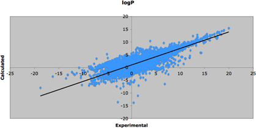

   Figure 4. Scatter plot of the entire set of experimental logP values versus calculated 
   logP. Only compounds with a molecular weight between 200 and 600 Da were used in this 
   scatter plot.
 
.. _1.0.2/filterit_figure05:

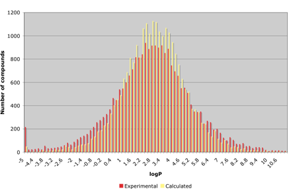

   Figure 5. Comparison of the distribution of the experimental and calculated logP values 
   for the entire set of 24,701 compounds. The means of the experimental and calculated 
   distributions are 2.75 and 2.79, respectively, while the corresponding standard 
   deviations are respectively 2.69 and 2.04.
 

.. _1.0.2/logs:

LogS
====

The implementation of the logS prediction in |filter-it| is based on a simple fragment-based 
method. For this, the logS is calculated from:

.. math::

   logS = 0.898 + 0.104 \sqrt{MOLWT} + w_i c_i

with :math:`w_i` and :math:`c_i` being the respective weights and counts for fragment *i*, 
and *MOLWT* the molecular weight of the compound. A list of the defined fragments with 
corresponding weights is provided below::

    i   Property                   w(i)
   --   -----------------------   ------
    0   Count of [NH0;X3;v3]      +0.715
    1   Count of [NH2;X3;v3]      +0.411
    2   Count of [nH0;X3]         +0.825
    3   Count of [OH0;X2;v2]      +0.315
    4   Count of [OH0;X1;v2]      +0.148
    5   Count of [OH1;X2;v2]      +0.630
    6   Count of [CH2;!R]         -0.356
    7   Count of [CH3;!R]         -0.339
    8   Count of [CH0;R]          -0.219
    9   Count of [CH2;R]          -0.231
   10   Count of [ch0]            -0.376
   11   Count of [ch1]            -0.224
   12   Count of F                -0.217
   13   Count of Cl               +0.497
   14   Count of Br               -0.580
   15   Count of I                -0.515

A plot of the calculated versus the experimental logS values is given in :ref:`Figure 6<1.0.2/filterit_figure06>`:

.. _1.0.2/filterit_figure06:

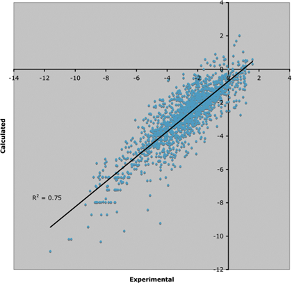

   Figure 6. Scatter plot of the experimental versus calculated logS values.
 

TPSA
====

The topological polar surface area implementation in |filter-it| is based on the work 
of Peter Ertl and coworkers [#ertl]_.  

.. _1.0.2/le:

Ligand efficiency
=================

The ligand efficiency in this version of |filter-it| is a proprietary version calculated 
using a fragment-based approach, in which the coefficients were obtained by fitting 
against 857 experimentally determined binding free energies from the 
`Binding MOAD <http://www.bindingmoad.org/>`_ database and the calculated ligand 
efficiencies thereof.

The predicted ligand efficiency is calculated from the following equation:

.. math::

   LE = -0.013 hba + 0.0849 hcr + 0.0036 tpsa - 0.014 \frac{tpsa}{\ln (atoms) } - 0.3156 \ln (atoms)

with *LE* being the calculated ligand efficiency, *hba* the number of hydrogen bond 
acceptors as calculated by the ``HBOND_ACCEPTORS`` filter, *hcr* the hetero/carbon ratio as 
calculated by the ``HETERO_CARBON_RATIO`` filter, *tpsa* the topological polar surface area 
as calculated by the ``TPSA`` filter, and *atoms* being the total number of non-hydrogen 
atoms as calculated by the ``ATOMS`` filter.

Analysis of this regression equation shows that the ligand efficiency is influenced 
by a subtle equilibrium between the number of atoms and the topological polar surface area. 
For smaller ligands, optimal ligand efficiency is achieved when the topological polar 
surface area is increased, while for larger compounds the reverse is true 
(:ref:`Figure 7<1.0.2/filterit_figure07>`):

.. _1.0.2/filterit_figure07:

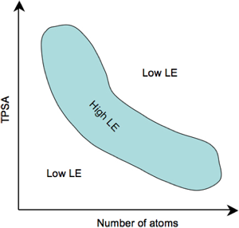

   Figure 7. Subtle equilibrium between the topological polar surface area (TPSA), 
   the number of atoms, and the ligand efficiency (LE).
 
For optimal ligand efficiency, small fragments should be as polar as possible, while 
the larger, more drug-like molecules, should be rather lipophilic. In addition to this 
equilibrium between the number of atoms and topological polar surface area, ligand 
efficiency is also increased by a larger hetero atom/carbon ratio, but increasing the 
number of hydrogen bond donor atoms rather than increasing the acceptor atoms should 
only increase this hetero atom/carbon ratio.
 
The experimental versus predicted ligand efficiencies are plotted in :ref:`Figure 8<1.0.2/filterit_figure08>`. 
Distributions of the two populations are shown in :ref:`Figure 9<1.0.2/filterit_figure09>`.

.. _1.0.2/filterit_figure08:

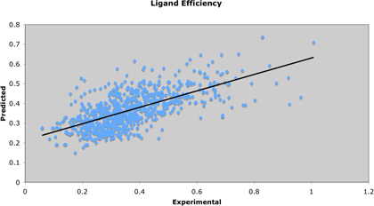

   Figure 8. Experimental versus predicted ligand efficiencies as calculated by the 
   method in |filter-it|. Residual standard error is 0.1075 on 851 degrees of freedom.
   R\ :sup:`2`\  equals 0.42.

.. _1.0.2/filterit_figure09:

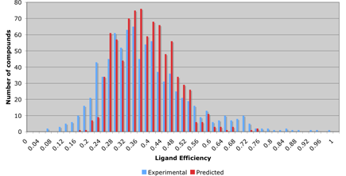

   Figure 9. Distribution of the predicted and calculated ligand efficiencies that 
   were used in the training of the model. The mean of the experimental distribution
   is 0.37 with a standard deviation of 0.14, while the mean of the predicted distribution
   is also 0.37 with a standard deviation of 0.15.
 
An alternative approach to extract compounds that might have an intrinsic large ligand 
efficiency is to focus on the number of heavy atoms. This approach has the advantage 
that it is not based on an underlying mathematical model that has been trained on a 
rather limited dataset with possibly restricted predictive power. The distribution of 
the number of atoms for molecules having a smaller or larger experimental ligand efficiency 
than the mean is shown in :ref:`Figure 10<1.0.2/filterit_figure10>`. From this figure, it is clear 
that there is a significant difference to be noted between the two distributions. For 
molecules with an experimental ligand efficiency larger than the mean ligand efficiency (>0.37), 
the distribution peaks around 18-22 heavy atoms, while for the molecules with a ligand 
efficiency <0.37 the maximum is around 34 heavy atoms. A total of 28 atoms seems to 
be the cutoff value to separate both distributions.

.. _1.0.2/filterit_figure10:

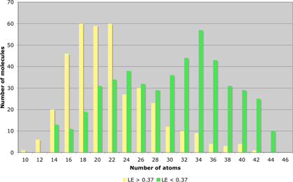

   Figure 10. Histogram showing the distribution of the number of atoms as a function 
   of the experimental ligand efficiency (LE). The yellow bars show the distribution 
   of all molecules having an experimental LE that is larger than the mean (> 0.37), 
   while the green bars show the distribution of all molecules with an experimental 
   LE smaller than 0.37.
 
Based on these observations, an interesting alternative approach could be to include a 
filter based on the number of atoms, for example keeping only those molecules in which 
the total number of heavy atoms is between 12 and 28. The accuracy of this approach 
in extracting molecules having a ligand efficiency larger than 0.37 is somewhat less 
than with the ``LIGAND_EFFICIENCY`` filter approach, but the predictive power might 
be comparable:

.. raw:: html

   <table class="le">
   <tr> 
       <th></th>
       <th colspan="2">Predicted LE</th>
       <th colspan="2">Number of atoms</th>
   </tr>
   <tr>
       <th></th>
       <th style="text-align:center"> <0.37</th>
       <th style="text-align:center"> >0.37</th>
       <th style="text-align:center"> >27</th>
       <th style="text-align:center"> <27</th>
   </tr>
   <tr>
       <td>True LE <0.37</td>
       <td style="text-align:center">44.3%</td>
       <td style="text-align:center">13.0%</td>
       <td style="text-align:center">34.9%</td>
       <td style="text-align:center">21.4%</td>
   </tr>
   <tr>
       <td>True LE >0.37</td>
       <td style="text-align:center">9.8%</td>
       <td style="text-align:center">32.6%</td>
       <td style="text-align:center">5.8%</td>
       <td style="text-align:center">35.5%</td>
   </tr>
   </table>

.. _1.0.2/distance:

Distance filters
================

Distance filters are implemented as geometrical distance constraints between 
user-specified patterns. These patterns are implemented as 
SMARTS queries. 
Since a given pattern may have more than one occurrence in a given molecule, a 
specific procedure is needed to ensure consistency between the different distance 
constraints. In the following sections, this procedure is highlighted in more detail.
For consistency, the following nomenclature is used:

pattern
	a SMARTS representation of the user-defined substructure;

match
	a match occurs when a pattern is found in a given molecule. 
	For each pattern, there could be a single match, multiple matches, or none 
	(:ref:`Figure 11<1.0.2/filterit_figure11>`).

.. _1.0.2/filterit_figure11:

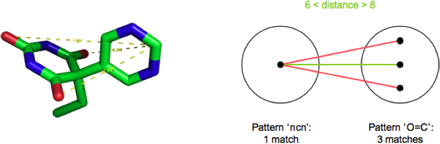

   Figure 11. Example showing the relation between pattern and matches. 
   In the example given in this figure, the molecule has three occurrences 
   of a carboxyl group, and therefore three matches of the ``C=O`` pattern. 
   In addition, a single match was found for the ``ncn`` pattern. Between the matches 
   of both patterns, 1 x 3 distances can be calculated, and of which only one 
   distance falls within the limits of 6-8 Å. Since at least one distance is fitting 
   within the user-defined limits, the distance criterion id considered to 
   fulfill the criteria.
 
A distance constraint between two patterns is obeyed if the distance between the two 
patterns falls within the defined limits of the distance constraint. When multiple matches 
are found for a given pattern, it is sufficient for a distance to be obeyed if the 
distance between at least one of the matches is falling within the limits 
(:ref:`Figure 11<1.0.2/filterit_figure11>`).

With three or more patterns per molecule, the situation becomes slightly more complicated. 
In this case, only the matches that obey all distances are considered in the final 
criteria (:ref:`Figure 11<1.0.2/filterit_figure12>`).

.. _1.0.2/filterit_figure12:

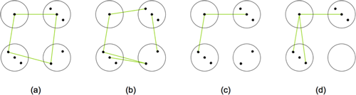

   Figure 12. The four distance constraints are along the edges of the squares (not shown), 
   and the distance that obey the user-defined criteria are shown in green. (a) Example 
   that fulfills are distance constraints and therefore considered to be a ‘pass’. 
   (b) Example in which the distance constraints between the four patterns are fulfilled, 
   but because non-consistent matches are involved it is considered to be a ‘fail’. 
   (c) Example of a ‘fail’ since two of the four distance constraints are not fulfilled.
   (d) Another example of a ‘fail’ since for one pattern there are no matches.

************
Installation
************

Installation of the |filter-it| program relies on the libraries of **OpenBabel** version 2.3. 
Installation of **OpenBabel** is 
exemplified in the :ref:`Configuring OS X for chemoinformatics <configuring_osx_for_chemoinformatics>` 
section of this website.

The installation of |filter-it| assumes that the :envvar:`BABEL_DATADIR`, 
:envvar:`BABEL_LIBDIR`, and :envvar:`BABEL_INCLUDEDIR` point to the directories 
where **OpenBabel** has been installed::

	> echo $BABEL_INCLUDEDIR
	/usr/local/openbabel/include/openbabel-2.0/
	> echo $BABEL_LIBDIR
	/usr/local/lib/openbabel/2.3.1/
	> echo $BABEL_DATADIR
	/usr/local/openbabel/share/openbabel/2.3.1/

Start by downloading |filter-it| from our :ref:`software <software>` section and
un-tar this file into the :file:`/usr/local/src` directory::

	> cd /usr/local/src
	> sudo tar -xvf ~/Downloads/filter-it-1.0.2.tar.gz

Change into this directory and start the building process::

	> cd filter-it-1.0.2
	> sudo mkdir build
	> cd build
	> sudo cmake ..
	> sudo make
	> sudo make install
	
This latter command will install the |filter-it| executable in the :file:`/usr/local/bin/` directory.
Finally, check the installation by entering::

	> make test
	
This should complete all tests without errors.

**********
References
**********
 
.. [#ertl] Ertl, P.; Rohde, B.; Selzer, P. (2000) ‘Fast calculation of molecular polar surface 
   area as a sum of fragment-based contributions and its application to the prediction of drug 
   transport properties’, *J. Med. Chem.* **43**, 3714-3717 [`pubmed/11020286 
   <http://www.ncbi.nlm.nih.gov/pubmed/11020286>`_]

.. [#andrews] Andrews, P.R.; Craik, D.J.; Martin, J.L. (1984) ‘Functional group contributions 
   to drug-receptor interactions’, *J. Med. Chem.* **27**, 1648-1657 [`pubmed/6094812 
   <http://www.ncbi.nlm.nih.gov/pubmed/6094812>`_]

.. [#gleeson] Gleeson, P.M.; Hersey, A.; Montanari, D.; Overington, J. (2011) ‘Probing the 
   links between in vitro potency, ADMET and physicochemical parameters’, *Nature Rev. Drug 
   Discovery* **10**, 197-208 [`nature/nrd3367 <http://www.nature.com/nrd/journal/v10/n3/abs/nrd3367.html>`_]

.. [#egan] Egan, W.J.; Merz, Jr., K.M.; Baldwin, J.J. (2000) ‘Prediction of drug absorption 
   using multivariate statistics’, *J. Med. Chem.* **43**, 3867-3877
   [`acs/jm000292e <http://pubs.acs.org/doi/full/10.1021/jm000292e>`_]

.. [#lipinski] Lipinski, C.A.; Lombardo, F.; Dominy, B.W.; Feeney, P.J. (2001) 'Experimental 
   and computational approaches to estimate solubility and permeability in drug discovery and 
   development settings', *Adv. Drug Deliv. Rev.* **46**, 3-26 
   [`pubmed/11259830 <http://www.ncbi.nlm.nih.gov/pubmed/11259830>`_]

****************
Revision history
****************

Version 1.0.2
=============

[released on April 26, 2013]

Updated the copyright dates in the source code.

Included the `PAINS <http://pubs.acs.org/doi/abs/10.1021/jm901137j>`_ filter definition files which
were kindly provided by Chris Swain and also available
from his `macinchem <http://www.macinchem.org/reviews/pains/painsFilter.php>`_ site.

Version 1.0.1
=============

[released on September 20, 2012]

The input/output parameters and program logic have been improved:

* :option:`--pass=[file]` now requires the specification of an output [file]
* :option:`--fail=[file]` now requires the specification of an output [file]

Corrected a bug in the `SIMILARITY_STACK` property (molecules with
space-containing molecular titles were handled incorrectly).

Documentation has been updated and more information on the logic and use of standard 
output and standard error has been included.

Version 1.0.0
=============

This is the first official release of |filter-it|. The program is a successor of the program *Sieve*
from Silicos and is branched out of version 3.1.0 of *Sieve*.

Additions to the original *Sieve* version include:

* Added the :option:`--inputFormat`, :option:`--passFormat` and :option:`--failFormat` options;
* Added the possibility of directing output to standard output for the :option:`--fail` and
  :option:`--pass` cases.
* Ported the documentation to ``html`` and included some improvements.

